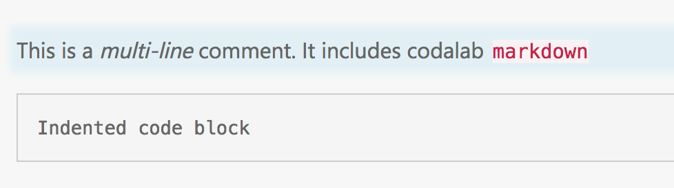
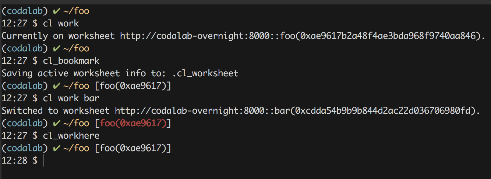

# codalab_bash
A couple of useful codalab bash commands.

### `cl_bookmark`
This command will save info about the currently-active worksheet.

### `cl_workhere`
This command will set the currently-active worksheet to the one specified by a previous `cl_bookmark` command.

Both `cl_bookmark` and `cl_workhere` use a hidden "dot-file" (`.cl_worksheet` by default) in the
local dir to record the bookmark info.

### `cl_comment`
This command will add a comment at the end of the currently-active worksheet. (This is basically just a 
wrapper around `cl add text "comment" .`) 

For example,

``` bash
$ cl_comment "This is a comment"
```

You can also add the text from a file:

``` bash
$ cat tmp.txt
This is a *multi-line* comment.
It includes codalab `markdown`

    Indented code block

$ cl_comment "$(cat tmp.txt)"
```
which would look like this in the rendered codalab worksheet:



## Installation
Clone this repo locally and add something like the following to your `.bashrc`:

``` bash
if [ -f "${HOME}/projects/codalab_bash/codalab_bash.sh" ]; then
    source "${HOME}/projects/codalab_bash/codalab_bash.sh"
fi
```

## Integration with [bash-git-prompt](https://github.com/magicmonty/bash-git-prompt)
If you are using [bash-git-prompt](https://github.com/magicmonty/bash-git-prompt) you can include
information about the currently-bookmarked worksheet into the prompt. This is done using the
`prompt_callback` function of `bash-git-prompt`.

For example, if you have installed `bash-git-prompt` via homebrew on a Mac:

``` bash
if [ -f "${HOME}/projects/codalab_bash/codalab_bash.sh" ]; then
    source "${HOME}/projects/codalab_bash/codalab_bash.sh"
fi

if [ -f "$(brew --prefix)/opt/bash-git-prompt/share/gitprompt.sh" ]; then
    
    function prompt_callback {
        local cl_prompt
        if [ -z ${HAVE_CL_BASH+x} ]; then
            echo ""
        else
            if ! cl_prompt=$(CL_PROMPT_INFO); then
                echo ""
            else
                if ! CL_WS_IS_CONSISTENT; then
                    echoc " [${BoldRed}${cl_prompt}${ResetColor}]"
                else
                    echo " [${cl_prompt}]"
                fi
            fi
        fi
    }
    
    # For customization info see: https://github.com/magicmonty/bash-git-prompt
    __GIT_PROMPT_DIR=$(brew --prefix)/opt/bash-git-prompt/share
    source "$(brew --prefix)/opt/bash-git-prompt/share/gitprompt.sh"
fi
```
This will add the name and partial UUID of the currently-bookmarked worksheet into your prompt. And if the
bookmarked worksheet is not the same as the currently-active worksheet, the info in the prompt will
appear in "BoldRed" to alert you to the inconsistency:



